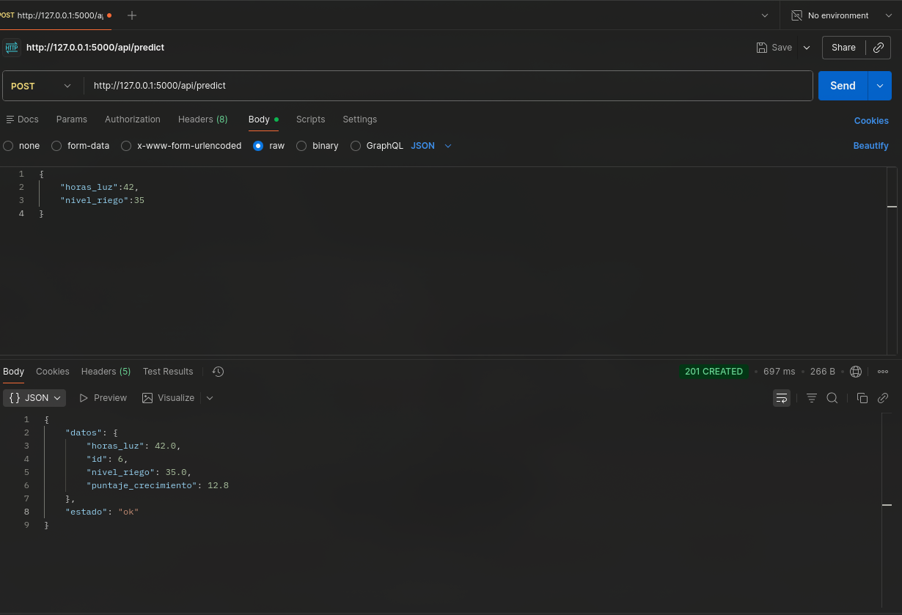
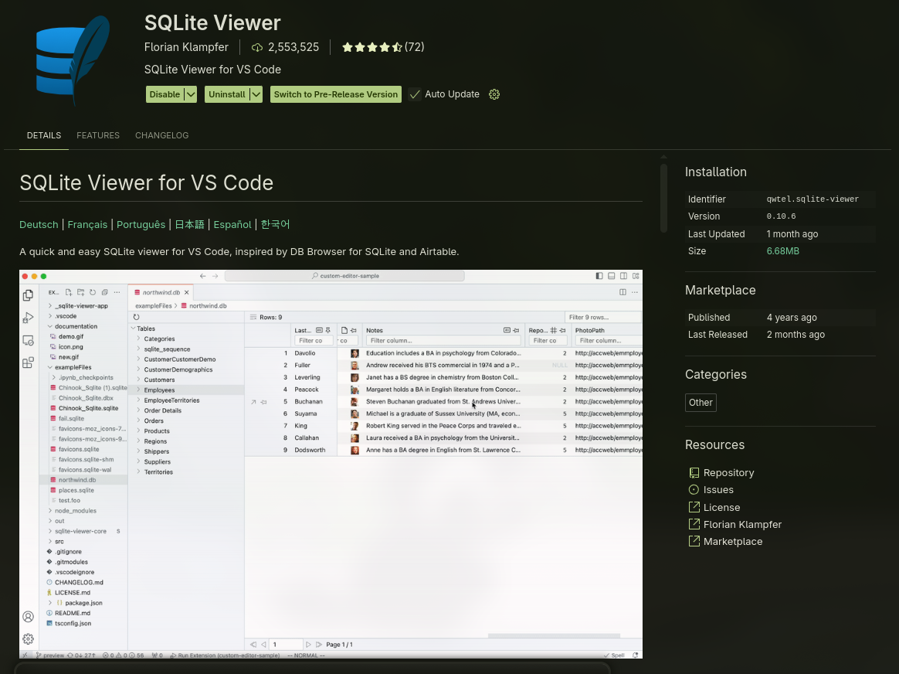

# Introducción

Simulador de cultivo : una app Flask que recibe horas de luz solar y nivel de riego para estimar el puntaje de crecimiento de una parcela ficticia. Este es el punto de partida para incorporar el resto de componentes del proyecto final (persistencia, concurrencia, APIs, etc.).

# Ejecución rápida

## Con uv

1. Instala dependencias declaradas en `pyproject.toml`:
    ```bash
    uv sync
    ```
2. Ejecuta la app web:
    ```bash
    uv run app.py
    ```

## Con Python estándar

1. Crea/activa un entorno virtual y luego instala requisitos:
    ```bash
    python -m venv .venv
    source .venv/bin/activate  # o .\.venv\Scripts\activate en Windows
    pip install -r requirements.txt
    ```
    Para reentrenar el modelo usa `pip install -r requirements-train.txt` en un entorno aparte.
2. Inicia la app:
    ```bash
    python app.py
    ```

La aplicación levanta en `http://localhost:5000/`. Puedes probar la API REST con:

```bash
curl -X POST http://localhost:5000/api/predict \
     -H "Content-Type: application/json" \
     -d '{"horas_luz":42,"nivel_riego":35}'
```

Otra opcion mas grafica es utilizar Postman

<div align="center">
  
</div>
Puedes ingresar a https://www.postman.com/ para descargarlo y hacer tus pruebas (Principal motivo por el cual implemente API REST JSON)

# Estructura general del repositorio

```
├── app.py
├── database.py
├── docs/
│   ├── images/
│   ├── InformeProyecto.pdf  <--- ACA SE ENCUENTRA EL INFORME DEL PROYECTO
├── files_for_training_model/
│   ├── growth_data.csv
│   ├── train.py
│   └── README.md
├── models/
│   ├── model.pkl
│   └── README.md
├── services/
│   ├── simulaciones.py
│   ├── validacion.py
│   └── README.md
├── templates/
│   ├── index.html
│   └── README.md
├── requirements.txt
├── requirements-train.txt
├── pyproject.toml
└── README.md
```

El resto de carpetas (`instance/`, `.venv/`) están ignoradas por Git y/o se rellenan en ejecución.

## ¿Por qué estas mejoras?

-   **Cambio de temática**: el dataset original de heart disease resultaba difícil de conectar con sensores, persistencia y visualizaciones. Renombrar la problemática a cultivo permite explicar fácilmente los inputs y justifica futuros módulos (p.ej., un sensor de soporte que reporte luz o riego).
-   **Persistencia + validaciones + API JSON**: forman un flujo completo. Persistir cada simulación en SQLite (SQLAlchemy) garantiza trazabilidad; las validaciones compartidas evitan que el modelo reciba datos erróneos; y el endpoint REST (`POST /api/predict`) habilita la exposición de servicios que pide el proyecto.
-   **Modelo entrenado propio**: se documenta cómo regenerar `model.pkl` con datos renombrados, demostrando que la app depende de un modelo real y está lista para entrenar con nuevos datos.

## Flujo del sistema

1. Usuario (HTML o API) envía `horas_luz` y `nivel_riego`.
2. `services/validacion.py` valida rangos/tipos; si hay errores, se devuelven de inmediato.
3. `services/simulaciones.py` carga el modelo, calcula el puntaje y guarda la simulación en SQLite.
4. La respuesta llega como vista HTML o JSON con el ID del registro almacenado.

# Dependencias necesarias

-   **Ejecución web**: Flask 3.1.2, SQLAlchemy 2.0.36, NumPy 2.3.5, scikit-learn 1.7.2 (se instalan desde `pyproject.toml` o `requirements.txt`).
-   **Reentrenamiento del modelo**: pandas y scikit-learn (listadas en `requirements-train.txt`). Se recomienda ejecutarlo en un entorno separado para no mezclar dependencias.
-   **SQLite Viewer(opcional)**: extension de VSC que sirve para revisar `instance/growth.db`, pero no es obligatorio.
<div align="center">
  
</div>

# Proposito del sistema

Ofrecer un microservicio sencillo que toma parámetros de control de una parcela (horas de luz y nivel de riego), estimar su puntaje de crecimiento mediante un modelo entrenado con scikit-learn y guardar cada simulación en SQLite. Sirve como base para probar extensiones del curso: persistencia real, API REST, validaciones consistentes, futuros módulos concurrentes/sockets, etc.

# Implementaciones

-   **Persistencia con SQLAlchemy**: cada simulación validada se almacena en `sqlite:///instance/growth.db` con los parámetros ingresados, el puntaje estimado y la fecha. Esto habilita auditorías, análisis estadísticos y reentrenamientos futuros.
-   **API REST JSON**: ruta `POST /api/predict` que recibe `{ "horas_luz": float, "nivel_riego": float }`, reutiliza las mismas validaciones del formulario y devuelve un objeto JSON con el puntaje de crecimiento y el ID de simulación almacenado. Ideal para integrar sensores, automatizaciones o pruebas con herramientas HTTP.
-   **Arquitectura modular**: la lógica de validación y simulación se separó en `services/validacion.py` y `services/simulaciones.py`, facilitando su reutilización desde vistas HTML, APIs y futuros componentes concurrentes.

# Creditos

El proyecto tomo de base el ejemplo de DigitalSreeni para desplegar un modelo de machine learning ya entrenado hacia una local web application usando Flask

-   Video de DigitalSreeni: https://youtu.be/bluclMxiUkA?t=1342
-   Repositorio clonado (Solamente el directorio 268): https://github.com/bnsreenu/python_for_microscopists

# Simple Open License (MIT-style)

Copyright (c) 2025 Yeremy

You can use this code however you want.  
Feel free to copy it, change it, improve it, share it, or use it as part of
your own projects — academic or otherwise.

The only thing I ask is to keep this short notice somewhere in your copy,
just so people know where it originally came from.

This project is provided "as is", with no promises or guarantees.  
Use it at your own risk and have fun.
